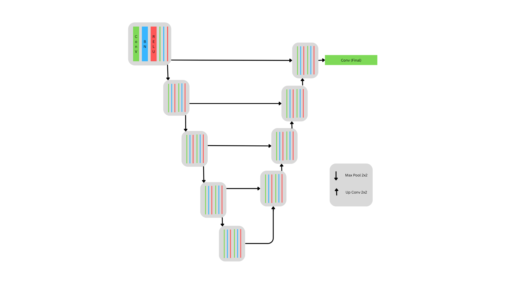

# U-Net Image Segmentation

This repository contains an implementation of the U-Net architecture for semantic image segmentation using PyTorch. U-Net is a fully convolutional neural network originally designed for biomedical image segmentation, and it has since become a widely used baseline in various segmentation tasks.

## 📁 Project Structure

├── unet.ipynb # Jupyter notebook with dataset, model, training, evaluation, and visualization  
├── data/ # Directory for dataset images and masks  
├── images/  
├── models/ #Contains trained model  
└── README.md # Project documentation

## 🚀 Features

- U-Net architecture with encoder-decoder and skip connections
- Batch Normalization, Dropout (optional), and ReLU activations
- Training loop with loss tracking
- Evaluation metrics: Pixel Accuracy, Mean IoU, Dice Coefficient
- Visualization of input, prediction, and ground truth

## 🧠 Model Architecture

The U-Net is composed of:

- Contracting path (encoder): 4 downsampling blocks with convolution, batch norm, ReLU, and max-pooling.
- Bottleneck layer: 1024 filters to extract deep semantic features.
- Expanding path (decoder): 4 upsampling blocks using transpose convolutions and skip connections.
- Final 1×1 convolution layer to project to the desired number of output classes.

## 📊 Results

| Metric           | Value                    |
| ---------------- | ------------------------ |
| Pixel Accuracy   | 0.9068                   |
| Mean IoU         | [0.9019, 0.8251, 0.5387] |
| Dice Coefficient | [0.9479, 0.9028, 0.6989] |

## 📚 Dataset

- Can be used with Oxford-IIIT Pet Dataset.
- Dataset directory structure:

data/oxford-iiit-pet/ 
├── images/ 
│ ├── img1.png 
│ └── ... 
└── annotations/trimaps/ 
├── mask1.png 
└── ... 
